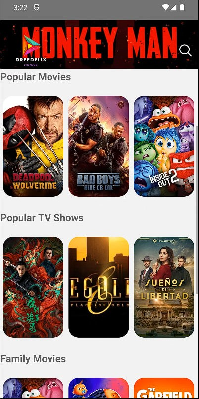
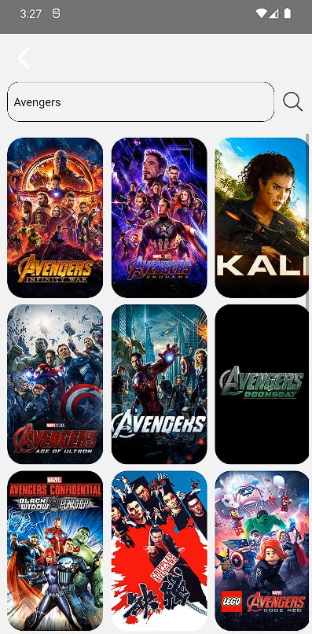
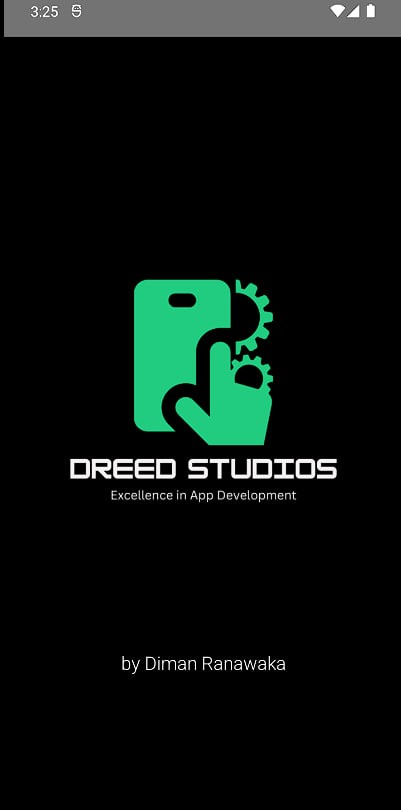

# 🎬 React Native Movie App

<p align="center">
  
  
  
</p>

<p align="center">
  <a href="https://github.com/dimanranawaka/react-native-app/issues">
    
  </a>
  <a href="https://github.com/dimanranawaka/react-native-app/network/members">
    
  </a>
  <a href="https://github.com/dimanranawaka/react-native-app/stargazers">
    
  </a>
  <a href="https://github.com/dimanranawaka/react-native-app/blob/main/LICENSE">
    
  </a>
</p>

---

## 🚀 Project Overview

Welcome to the **React Native Movie App**! This project is designed to provide a comprehensive movie browsing experience, featuring movie catalogs, detailed movie information, and video playback.

### Key Features

- **🎞️ Movie Catalog and Slider:** Browse through a vast catalog of movies with a sleek slider.
- **📄 Movie Details:** Detailed information about each movie.
- **▶️ Video Playback:** Watch movie trailers and videos within the app.
- **💎 User Interface and Experience:** Modern and intuitive UI/UX for a seamless experience.

---

## 🛠️ Technologies Used

- **React Native CLI:** For robust mobile app development.
- **React Navigation:** For smooth screen navigation.
- **Axios:** To make API requests.
- **TMDB Movie Database API:** Fetching movie data from TMDB.
- **External Packages:** For media playback and other functionalities.

---

## 🛠️ Installation

To get started with the React Native Movie App, follow these steps:

1. **Clone the Repository:**

    ```bash
    git clone https://github.com/dimanranawaka/react-native-app.git
    cd react-native-app
    ```

2. **Install Dependencies:**

    ```bash
    npm install
    ```

3. **Set Up Environment Variables:**

   Create a `.env` file in the root directory and add the necessary environment variables for TMDB API.

4. **Run the Development Server:**

    ```bash
    npm start
    ```

---

## 💻 Usage

Once the application is up and running, you can:

1. **Browse Movies:** Explore the movie catalog.
2. **View Details:** Click on any movie to see detailed information.
3. **Watch Trailers:** Enjoy video playback within the app.

---

## 🤝 Contributing

We welcome contributions to enhance the React Native Movie App! To contribute:

1. **Fork the Repository**
2. **Create a New Branch:** (`git checkout -b feature-branch`)
3. **Make Your Changes** and **Commit Them:** (`git commit -m 'Add new feature'`)
4. **Push to the Branch:** (`git push origin feature-branch`)
5. **Open a Pull Request**

Please ensure your code adheres to our coding guidelines and includes relevant tests.

---

## 📄 License

This project is licensed under the MIT License. See the [LICENSE](./LICENSE) file for details.

---

## 📬 Contact Information

For any inquiries or feedback, please contact:

- **Diman Ranawaka**
- Email: [dimanranawaka@example.com](mailto:dimanranawaka@example.com)
- GitHub: [dimanranawaka](https://github.com/dimanranawaka)

---

<p align="center">
  Made 🧑‍💻🛠️ by <a href="https://github.com/dimanranawaka">Diman Ranawaka</a>
</p>
